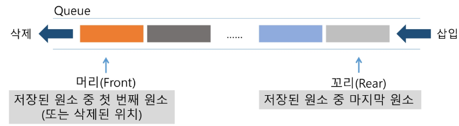
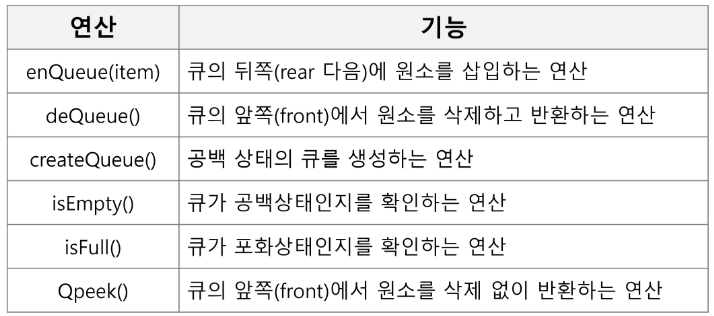

# APS (Algorithm Problem Solving)

## 큐 (Queue)

### 큐의 특성
- 스택과 마찬가지로 삽입과 삭제의 위치가 제한적인 자료구조
    - 큐의 뒤에서는 삽입만 하고, 큐의 앞에서는 삭제만 이루어지는 구조

- ***선입선출구조***(FIFO : First In First Out) 
    - 큐에 삽임한 순서대로 원소가 저장되어, 가장 먼저 삼입(first In) 된 원소는 가장 먼저 삭제(First Out)된다.

### 큐의 구조 및 기본 연산
- 큐의 선입선출 구조

- 큐의 기본 연산
    - 삽입 : enQueue
    - 삭제 : deQueue

- 큐의 주요 연산

1) 공백 큐 생성 : createQueue();
                크기가 정해진 큐를 만든다.

