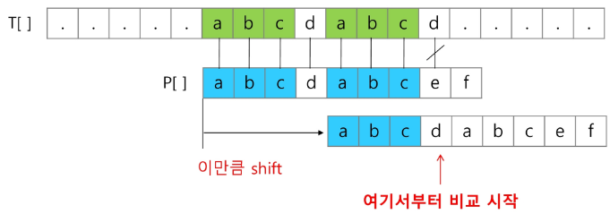
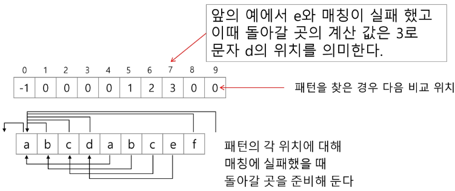
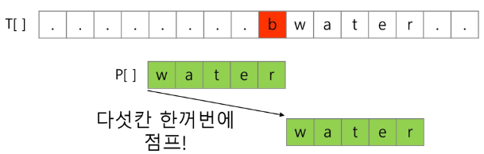
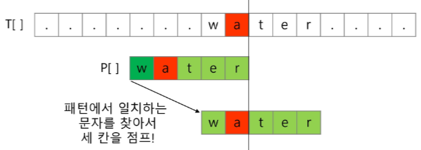
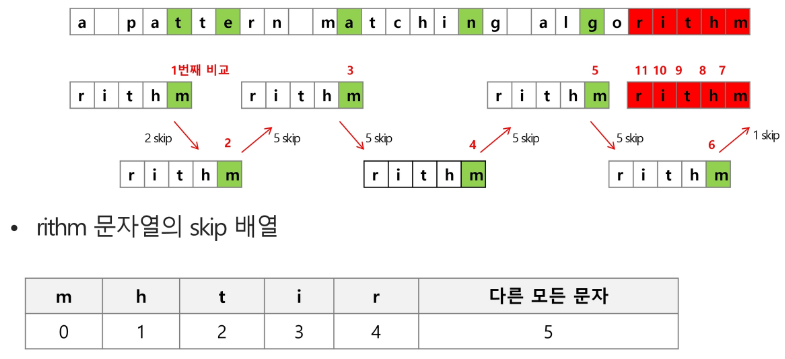

# String

##  패턴 매칭

- 패턴 매칭에 사용되는 알고리즘들
    - 고지식한 패턴 검색 알고리즘
    - 카프 - 라빈 알고리즘
    - KMP 알고리즘
    - 보이어-무어 알고리즘

### 고지식한 알고리즘(Brute Force) - 3가지 방법
    
- 본문 문자열을 처음부터 끝까지 차례대로 순회하면서 패턴 내의 문자들을 일일이 비교하는 방식으로 동작

    

```python
p = "is"                    #찾을 패턴
t =  "This is a book~!"     # 전체 텍스트
M = len(p)                  #찾을 패턴의 길이
N = len(t)                  # 전체 텍스트의 길이

def BruteForce(p,t) :
    i = 0       #t의 인덱스
    j = 0       #p의 인덱스
    while j < M and i < N:
        if t[i] != p[j] :
            i = i - j
            j = -1
        i = i + 1
        j = j + 1
    if j == M : return i - M    # 검색 성공
    else : return -1            # 검색 실패
```

- 고지식한 패턴 검색 알고리즘의 시간 복잡도
    - 최악의 경우 시간 복잡도는 텍스트의 모든 위치에서 패턴을 비교해야 하므로 O(MN)이 됨
    - 길이가 10000인 문자열에서 길이 80인 패턴을 찾는다고 할 때, 최악의 경우 약 10,000*80 = 800,000번의 비교가 일어난다.
    - 비교횟수를 줄일 수 있는 방법은 없을까?

### KMP 알고리즘
- 불일치가 발생한 텍스트 스트링의 앞 부분에 어떤 문자가 있는지를 미리 알고 있으므로, 불일치가 발생한 앞 부분에 대하여 다시 비교하지 않고 매칭을 수행

- 패턴을 전처리하여 배열 next[M] 을 구해서 잘못된 시작을 최소화함
    - next[M] : 불일치가 발생했을 경우 이동할 다음 위치

- 시간 복잡도 : O(M+N)

- 아이디어 설명
    - 텍스트에서 abcdabc까지는 매치되고, e에서 실패한 상황 패턴의 맨 앞의 abc와 실패 직전의 abc는 동일함을 이용할 수 있다.
    - 실패한 텍스트 문자와 P[4] 를 비교한다.

    
    - 매칭이 실패했을 때 돌아갈 곳을 계산한다.
    

### 보이어 - 무어 알고리즘
- 오른쪽에서 왼쪽으로 비교
- 대부분의 상용 소프트웨어에서 채택하고 있는 알고리즘
- 보이어-무어 알고리즘은 패턴에 오른쪽 끝에 있는 문자가 불일치 하고 이 문자가 패턴 내에 존재하지 않는 경우, 이동 거리는 무려 패턴의 길이만큼이 된다.


- 오른쪽 끝에 있는 문자가 불일치 하고 이 문자가 패턴 내에 존재할 경우


- 보이어-무어 알고리즘을 이용한 예


- 문자열 매칭 알고리즘 비교
    - 찾고자 하는 문자열 패턴의 길이 m, 총 문자열 길이 n
    - 고지식한 패턴 검색 알고리즘 : 수행시간 O(mn)
    - 카프-라빈 알고리즘 : 수행시간 O(n)
    - KMP 알고리즘 : 수행시간 O(n)

- 보이어-무어 알고리즘
    - 앞의 두 매칭 알고리즘들의 공통점 텍스트 문자열의 문자를 적어도 한번씩 훑는다는 것이다. 따라서 최선의 경우에도 Ω(n)
    - 보이어 - 무어 알고리즘은 텍스트 문자를 다 보지 않아도 됨
    - 발상의 전환 : 패턴의 오른쪽부터 비교
    - 최악의 경우 수행시간 : O(mn)
    - 입력에 따라 다르지만 일반적으로 O(n)보다 시간이 덜 든다. 

