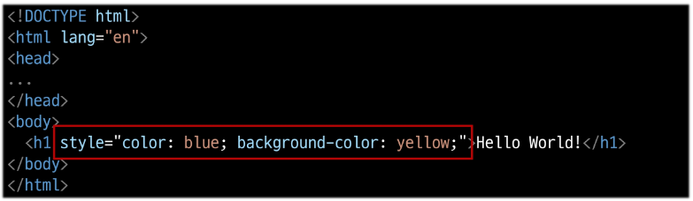
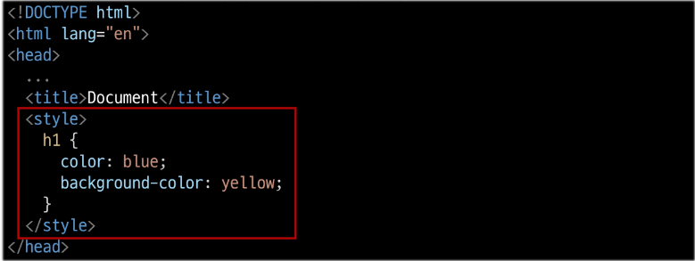

# Web 01
## HTML & CSS

- World Wide Web
    - 인터넷으로 연결된 컴퓨터들이 정보를 공유하는 거대한 정보 공간

###  Web
- Web site, Web application 등을 통해 사용자들이 정보를 검색하고 상호 작용하는 기술

-  Web site

    : 인터넷에서 여러 개의  Web page가 모인 것으로, 사용자들에게 정보나 서비스를 제공하는 공간

- Web page

    : HTML, CSS 등의 웹 기술을 이용하여 만들어진, "Web site" 를 구성하는 하나의 요소

## 웹 구조화

### HTML (HyperText Markup Language)

: 웹 페이지의 의미와 구조를 정의하는 언어

#### Hypertext 

: 웹 페이지를 다른 페이지로 연결하는 링크
    참조를 통해 사용자가 한 문서에서 다른 문서로 즉시 접근할 수 있는 텍스트

- 특징 
    - 비선형성
    - 상호연결성
    - 사용자 주도적 탐색

#### HTML Element(요소)
- 하나의 요소는 여는 태그와 닫는 태그 그리고 그 안의 내용으로 구성됨
- 닫는 태그는 태그 이름 앞에 슬래시가 포함됨
    - 닫는 태그가 없는 태그도 존재

#### HTML Attributes(속성) 작성 규칙
1. 속성은 요소 이름과 속성 사이에 공백이 있어야 함
2. 하나 이상의 속성들이 있는 경우엔 속성 사이에 공백으로 구분함
3. 속성 값은 열고 닫는 따옴표로 감싸야 함

HTML 시작할 때 !+tab 키 누르면 됨

#### HTML Text structure
    - HTML의 주요 목적 중 하나는 텍스트 구조와 의미를 제공하는 것

<!-- - <h1>Heading</h> -->
    - 예를 들어 h1 요소는 단순히 텍스트를 크게만 만드는 것이 아닌
        현재 **'문서의 최상위 제목'**이라는 '의미'를 부여하는 것
        

---
---
---

## 웹 스타일링
### CSS

- CSS (Cascading Style Sheet)
    
    : 웹 페이지의 디자인과 레이아웃을 구성하는 언어

#### CSS 적용 방법
1. 인라인(Inline) 스타일
    - HTML 요소 안에 style 속성 값으로 작성
    
2. 내부(Internal) 스타일
    - head 태그 안에 style 태그에 작성
    
3. 외부(External) 스타일

#### ***CSS 선택자***

- CSS Selectors

